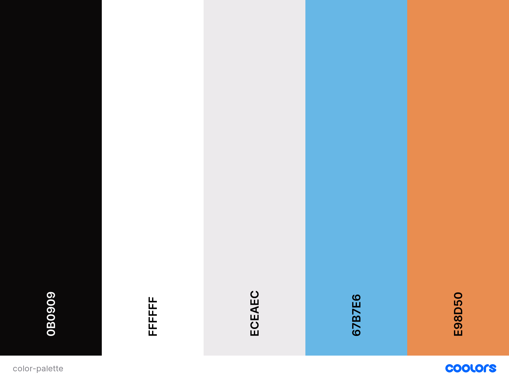

# Boots Review 

The Boots review site has the main goal of being a site where people can go to view reviews of different pairs of football boots that other people have owned. The aim is that this will be a site they can visit to assist them in making the decision of what pair of boots to purchase. 

A secondary aim of the site is that when these people have bought their pair of boots, they will be able to review their new pair of boots and assist others in making their decision. 

## Table of Contents
* User Experience (UX)
    * Site Owner Goals
    * User Goals
    * User Stories
        * First Time User
        * Registered User
    * User Requirements
    * User Expectations
    * Design Choices
        * Fonts
        * Colours
        * Icons
        * Wireframes
        * Data Schema 
* Features
    * Implemented Features
    * Features Yet To Implemented
* Technologies Used
    * Languages
    * Frameworks & Libraries
    * Tools
* Testing
    * User Story Testing
    * Validator Testing 
    * Feature Testing 
    * Lighthouse Testing
    * Compatability Testing
    * CRUD Testing
    * Bugs
* Deployment
* Credits
* Final Comments

## User Experience (UX)

### Site Owner Goals
* As a site owner, I want to give users no usability of the site without the requirement to register. This will ecourage registration.
* As a site owner, I would like to make it a requirement to sign up if users want to review a pair of football boots they have recently worn and then update and delete their reviews thereafter. 
* As a site owner, I would like to collect a database of reviews of football boots
* As a site owner, I would like to collect a database of star ratings of the football boots that are reviewed so that I can eventually create a ranking of the top rated boots
* As a site owner, I would like the site to be easy to use and intuitive
* As a site owner, I would like the site to have an attractive UI with an obvious color scheme
* As a site owner, I would like the user to be able to create, read, update and delete their profile
* As a site owner, I would like the user to be able to creat, read, update and delete their boots reviews
* As a site owner, I would like to have access to the admin section of the site that is off limits to the normal user.
* As a site owner, I want to be able to create read and update and delete the categories and makes of the football boots

### User Goals
* I would like the site to be responsive to different screen sizes so that I can use different devices to view the site
* I would like to feel like I am part of a community of people who have the same interest in football boots
* I would like to be given feedback from the site confirming when I have completed an action such as creating or deleting a review of a pair of football boots
* I would like to be able to create, read, update and delete my profile
* I would like to be able to create, read, update and delete my reviews
* I would like to be able to contact the site owner and provide some feedback on the site
* I would like to be able to search for specific boots
* I would lile to be able to search for reviews created by specific users based on their user names
* I would like to be able to search for reviews based on specific boot makes
* I would like to be able to search for reviews based on specific boot categories
* I would like to be able to have a record of all the reviews that I have created on my profile page
* I would like to be able to securely log out and end my user session

### User Stories
* As a user of the site, I would like to be able to register my details and create a secure account with a username and password
* As a user, I would like to be able to write a review of a pair of boots I wore
* As a user, I would like to be able to read a review that someone else wrote on a pair of boots
* As a user, I would like to be able to update/edit a review that I wrote
* As a user, I would like to be able to delete a review that I wrote on a pair of boots
* As a user, I would like to be able to see pictures of boots that have been reviewed
* As a user, I would like to be able to search the database for boot reviews based on makes, categories, reviewer, or Boots name 
* As a user, I would like to be able view, edit, and delete my profile 
* As a user, I would like to be able to view my reviews that I created in a centralised location in my profile page

### User Requirements
* The site needs to be easy to navigate between the different features via good UX and a concise navbar
* To be able easily see whether or not a CRUD action has been successful or not
* To have a landing page that tells the user what the page is at a glance
* To have a well laid out site that is easy to use and understandable
* To be able to read clearly any messaging that is displayed on screen via constrasting backgrounds
* To be given clear and easy to understand instructions via good UX
* To be able to contact the site owner to provide feedback or make a complaint if necessary
* To have my registration and personal data and password secure in the database
* All features need to be working as expected
* All features and functionality need to be well laid out and intuitive
* The site needs to be responsive across all devices and browsers

### User Expectations
* All of the content needs to be easily readable and contrasting with the background colours and imagery
* Navigation of the site needs to be really easy and intuitive
* The site owner should be easily contactable - contact page and contact info in the footer of the site
* Any forms should always provide me with instructions so that I know what input it expects

## Design Choices
Generally, football boots tend to be quite sleek and stylish so I decided to try and keep this site the same way. The overall look and feel of the site is very soft touch with nice lines and angles. The colours are quite bright and bold with lots of orange and black and blue and off white. The touch of colour, I feel gives the site an extra bit of style.

### Fonts
There is little text on the landing page. For the fonts, I used [Google Fonts](https://fonts.google.com/?standard-styles=). This is a really fantastic feature of [Google](https://google.com) which is great for getting any kind of font you want. The fonts I chose for my page are *Play* & *Roboto* with *sans-serif* as a backup font in the event that [Google Fonts](https://fonts.google.com/?standard-styles=) does not work. The reason I decided to use *Play* & *Roboto* is that I found them to be quite sleek fonts which would almost represent a pair of football boots. 

### Colours
In deciding the colour scheme for the site, I decided to go for a cool, almost retro mix between orange and blue mixed with black. There is often a lot of black with splashes of colour. The black tends to make the colour stand out and is a really good contrasting background for reading content. The same idea goes for the off white that is used throughout the site as well. 

I used the site [Coolors](https://coolors.co/) to assist in generating a colour scheme for the site. This is a great site as it gives you the codes of the colours you want in any form you want ie. Hex code. 

The colours I have chosen are: 
* Rich Black Fogra 39 - Hex (0B0909)
* White - Hex (FFFFFF)
* Platinum - Hex (ECEAEC)
* Aero - Hex (67B7E6)
* Persian Orange - Hex (E98D50)

### Icons 
I have gone to [Font Awesome](https://fontawesome.com/) for the icons that I have used in the site. The icons, I feel just add a little bit extra to the site in terms of style and make it a bit more visually appealing which ultimately provides a better User Experience.

### Wireframes
When creating my wireframes, I first drew some rough sketches on paper but then decided that [Balsamiq](https://balsamiq.com/) would be the most suitable technology to use to assist with the design of the site. 

I created mock ups for my page to fit into the main device types - Desktop, Tablet and Mobile. The mock-ups for the devices can be found here: 
* [Mobile]()
* [Tablet] ()
* [Desktop] ()

### Data Schema
To carry out the functionality of the site, I needed to create three different collections of data. They are: 
1. Users 
3. Categories
4. Reviews
7. Makes
8. Star Ratings

The Users collection is made up of the following fields: 
| Field    | Data Type | Default |
|----------|-----------|---------|
| id       | ObjectId  | N/A     |
| is_admin | boolean   | True    |
| username | string    | N/A     |
| password | string    | N/A     |
| bio      | string    | N/A     | 

The Categories collection is made up of the following fields:
| Field          | Data Type | Default |
|----------------|-----------|---------|
| id             | ObjectId  | N/A     |
| category_name  | string    | N/A     |

The Reviews collection is made up of the following fields:
| Field             | Data Type | Default |
|-------------------|-----------|---------|
| id                | ObjectId  | N/A     |
| user_id           | string    | N/A     |
| review            | string    | N/A     |
| star_rating_id    | string    | N/A     |
| image_url         | string    | N/A     |
| category          | string    | N/A     |
|boots_name         | string    | N/A     |
| make              | string    | N/A     |

The Makes collection is made up of the following fields:
| Field | Data Type | Default |
|-------|-----------|---------|
| id    | ObjectId  | N/A     |
| name  | string    | N/A     |

The Stars collection is made up of the following fields:
| Field  | Data Type | Default |
|--------|-----------|---------|
| id     | ObjectId  | N/A     |
| rating | number    | N/A     |

## Features
The site features are as follows: 
* Navigation bar at the top of the site for easy and intuitive navigation around the different pages of the site
* Registration page where the user can input their details, username and password
* Search bar for users to be able to search through the database:
    * to find reviews of particular boots that they want to read review of
    * to find reviews of boots that are of a certain make
    * to find reviews of boots that are of a certain star rating
* User feedback whenever they carry out any of the CRUD operations
* User feedback on forms in the case that they have not filled the form in correctly
* Bootstrap css design features such as navabr, buttons cards etc.
* Bootstraps responsive web design which allows users to use the site on all device sizes
* A beautiful looking profile page displaying a photo of the user, a bio and their reviews that they have written
* A landing page that lets the user know what the site is about at a glance
* To be able to sign out whenever the user is finished
* For the admin user to be able to manage the site such as add categories and makes

## Features Yet To Implement
* None

## Technologies Used

### Languages
* [HTML](https://en.wikipedia.org/wiki/HTML) - HTML is a markup language I used for structuring and presenting content of my site
* [CSS](https://en.wikipedia.org/wiki/CSS) - A language used to style the presentation of the content written in HTML5
* [Javascript](https://en.wikipedia.org/wiki/JavaScript) - Javascript is the language used to provide the interactivity to the user on the site
* [Python](https://www.python.org/) - Python is a backend programming language that is highly powerful and is designed around readability. It's language constructs and object oriented approach assist programmers in writing clear and easily read code

### Frameworks & Libraries
* [Bootstrap](https://getbootstrap.com/docs/4.6/getting-started/introduction/) - A front-end framework which assist me in creating responsive website design
* [Google Fonts](https://fonts.google.com/) - An open-source online library of thousands of fonts and icons that were free and easy to use.
* [Font Awesome](https://fontawesome.com/) - An open source online library of icons which I used for extra styling.
* [Pip3](https://pypi.org/project/pip/) - Pip3 is the package installer for Python and is used to download Python dependencies from the command line
* [BSON](https://en.wikipedia.org/wiki/BSON) - BSON is the binary encoding of JSON-like documents that MongoDB uses when storing documents in collections. It adds support for data types like Date and binary that aren't supported in JSON.
* [Pep8](https://pypi.org/project/pep8/) - Used pip3 to install pep8 validator which is a tool which ensures you stick to the pep8 compliance
* [Flask](https://flask.palletsprojects.com/en/2.0.x/) - used to import the following functions: flash, render_template, redirect, request, session, url_for
* [MongoDB](https://www.mongodb.com/1) - MongoDB is an object-oriented, simple, dynamic, and scalable NoSQL database. It where I stored the database for this project
* [Heroku](https://id.heroku.com/login) - Heroku is a container-based cloud Platform as a Service (PaaS). Developers use Heroku to deploy, manage, and scale modern apps to get it to the market
* [Werkzeug](https://werkzeug.palletsprojects.com/en/1.0.x/) - Workzeug is used in this project to for password security.

### Tools
* [Coolors](https://coolors.co/) - Used this to generate a colour scheme that matched what I wanted for the site.
* [Pexels](https://www.pexels.com/) - Online library of stock photos for use for free.
* [Balsamic](https://balsamiq.com/) - Software used to complete the wireframes. This was much easier than trying to draw.
* [CSS Formatter](https://www.cleancss.com/css-beautify/) - This is used to beautify the CSS code
* [Javascript Formatter](https://beautifier.io/) - This is used to beatify the Javascript code to ensure the correct formatting is applied
* [Git](https://en.wikipedia.org/wiki/Git) - System used version control
* [GitHub](https://github.com/) - This is where my project repository was stored.
* [GitPod](https://www.gitpod.io/) - Open source, online workspace used to work on my project
* [W3 HTML Validator](https://validator.w3.org/) - Used to validate my code to ensure that there were no errors.
* [W3 CSS Validator](https://jigsaw.w3.org/css-validator/) - Used to validate my code to ensure that there were no errors.
* [Chrome Dev Tools](https://developer.chrome.com/docs/devtools/Chrome) - A set of development tools to assist the user create web content. They are built directly into the browser
* [Lighthouse](https://chrome.google.com/webstore/detail/lighthouse/blipmdconlkpinefehnmjammfjpmpbjk?hl=en) - One of the Chrome Dev Tools which was used to assess the level of accessibility, performance and correctness that was provided by the site.
* [JS Fiddle](https://jsfiddle.net/) - An online playground IDE used to test and trial Javascript code with HTML and CSS
* [Youtube](https://www.youtube.com/) - Youtube videos are a great way to learn how to do different things if stuck on a particular piece of code
* [Favicon](https://favicon.io/) - An online tool that generates the icon that is found in the tab bar at the top of the page beside the title of the page.
* [RandomKeyGen](https://randomkeygen.com/) - A tool that creates a random password to be used

## Testing

### User Story Testing
1. #### User Registration
    1. #### Create a secure account with a username and password
    * #### Plan
    I planned to create the landing page with a button to for login and signup on the actual page as well as having nav items to these same pages so as to increase the likelyhood of the user seeing the link.
    The plan once the user gets to the registration page is to request that they create a username and secure password and click signup. I will discuss the form authentication for the patterns required in the username and password in the form authentication testing section.   
    * #### Implementation
    I did exactly as planned on this and created the landing page with the links found in Bootstrap buttons on the page and in the Bootstrap navbar as well so that the user would find it as easy as possible to get to these pages while also being able to see an attractive landing page.
    I created a separate page for the signup form to rest in and the set up the backend function to allow the user to add a record to the user collection in the database when they signup correctly.
    * #### Test
    To test the different scenarios of this part of the user story, I needed to test registering with a brand new username and an already existing username. I also tested the form validation to ensure the user data integrity and this is discussed in the form validation testing below.
    * #### Result
    The user registration worked exactly as expected and the user was not able to signup with an existing username and succesfully signed up with a username that didn't exist. When signup was successfull the user received a flash message to make them aware of same.
    
    This is a pass

    2. View profile (see profile testing no.8 below)
    3. Edit (see profile testing no.8 below)
    4. Delete (see profile testing no.8 below)

2. #### Reviews:
    1. #### Create
    * #### Plan
    The plan is for the user to be able to add a review is to have a button in the navbar and the profile page to allow them to essentially add a review from anyhere in the site as long as they are signed in. The user will click the button which will route them to the add review form. The form, again is valiated using the browsers in-built validation system. The user must fill in all the fields before they will be allowed to add a review so that the information is good in the database and also so that the page looks good when rendered.
    The user will be able to press the cancel button which will redirect them away from the add review form and to their profile page. Once the user clicks the submit button, this will send the record to the database and redirect the user to the profile page where they will be able to see a flash message confirming the action was successful and also see the review they just created alongside any other reviews they might have already made.

    * #### Implementation
    I created the buttons needed in the nav bar and the profile page to be able to add the reviews. I linked up the route to these buttons and created the form to add the review in html. Each of the fields is validated using the browser validation system and has a required attribute and a pattern for validation. In the form, the user can choose from a few predetermined select options for things like the boots category and make and star rating which ensures data integrity in the database. For simplification when filling out the form, I made the date of the review autofilled through the backend which always puts the date the review was actually completed. Once all the fields are filled in the user can click the submit button which sends the data to the database.

    * #### Test
    The test for this is to be signed into the site as a user to be able to access this feature and then click the button in the nav to add review which should take me to the relevant page to add a review and then add the review and ensure that the form and the submit button works as expected. Once the button is clicked the user should then be redirected to the profile page where a flash should appear confirming the action was successful and also see the review they just created alongside any other reviews they might have already made.
    The same will be done using the add review button that is in the profile page to ensure that both methods / routes are working as expected.
    * #### Result
    All of the features described above worked as expected and the testing was a success.

    1. #### View
    * #### Plan
    To view the reviews, the plan is for the user to be able to view their own reviews that they have created in their profile page. These will be visible underneath the user profile section where they will be able to see the profile pic and bio. The reviews will be listed and sorted by category alphabetically. The listed reviews, when visible in the profile page will have all the data that the user inputs in the add review form, including the review photo. The reviews will also have edit and delete buttons as well as a drop down to see the main body of the review. 
    * #### Implementation
    To implement this, I created a card for the reviews to be displayed and then looped through the reviews and created a card for each one in the database that belongs to the user in session. The cards contatain bootstrap buttons to edit and delete and also a button that targets a dropdown to display the written review. When the user is new to the site and does not have any reviews, there will be an alternative placeholder in the place of the reviews just letting the user know that they have no reviews as of yet and that they can add one by clicking the button found on the page. 
    
    * #### Test
    To test this, it would mean signing into the site with a user profile and initially not having any reviews created to see if there is some placeholder text in the space where the reviews should be. Then once this part is established, add a review and once you are directed back to the home page after completing the review, you should see the review on the profile page. 
    * #### Result
    Once the above steps are carried out and review is added, it appears on the home page as expected and displays in a grid format. The testing is a success. If more reviews are added, they all are displayed on the user's profile page.

    2. #### Edit
    * #### Plan
    The user should be able to edit the reviews that they create. The plan is to have an edit button on the review cards on the profile pages of the users so that the users can only edit their own reviews that they created. Once the button is pressed, they will be rrouted to the edit reviews page where they will see a form the same as the add review form. The only difference is that it will be pre-populated with the details of the review in question. Once the user changes any details of their boots review and submits the form, the will be redirected back to the profile page where the updates will be rendered.
    * #### Implementation
    Implementing this meant building a button and putting it in the card for the button and routing the user to the edit page via a function in the backend which passes the relevant review information to the page from the database. The user can then change the information in the html form and submit the data which is posted to the database and the user gets redirected to the homepage. 
    * #### Test
    To test this, I would have to have already have a review created and I would have to click on the edit button to ensure that the edit review page renders. Once this renders properly, I would have to ensure that all the data is being taken from the database correctly and put into the relevant fields in the form. I would then make some changes to this data and click on the submit button to post these changes back to the database. Once the profile page displays again, I would have to ensure that the edited changes have displayed correctly as this would provide confirmation of the edits being posted correctly. 
    * #### Result
    After completing the action outlined above, all of the desired results were achieved. The test is a success.

    3. #### Delete
    * #### Plan
    The user should be able to delete the reviews that they create. The plan is to have a delete button on the review cards on the profile pages of the users so that the users can only delete their own reviews that they created. Once the user clicks the delete button, it is planned that a warning modal should pop up on screen requesting them to confirm that they want to delete the review. This is good defensive programming. The user should then be able to either exit out of the modal or confirm the deletion. The modal then closes and the review deletes and dissapears from the page. A flash messsage should then display to confirm the action has been successfull. 
    * #### Implementation
    To implement this, it was important to put in place some defensive programming and making the first delete button trigger the modal to pop up rather than have the review delete immediately. So the delete function in the backend is only triggered by the modal delete button.
    * #### Test
    The user should click the delete button and see the modal appear immediately warning them that the data is irretrievable once it's been deleted and requesting them to confirm deletion. If the user clicks to close the modal, the modal should close and if they click the delete button, the review should delete from the database and disappear from the user's profile page.
    * #### Result
    The review deleted when this test was carried out. This is a successfull test.

3. #### Read a review that someone else wrote
    * #### Plan
    All users should be able to see the main database of review records in a centralised location. The reviews page should display all the reviews in the database. The user should be able to see the card of each review be able to click on the dropdown to be able to read the review part itself.
    * #### Implementation
    The review are rendered to the database via the backend in a list. All the reviews are displayed in a card that has been looped through in the html document using jinja. Each review has all the information from the review displayed and contains a button to display the dropdown which contains the reviewers comments on the review. The button is in the review image.
    * #### Test
    The test for this is simply for the tester to navigate to the reviews page through the navbar and ensure that they can view the reviews
    * #### Result
    All of the results were as expected. Successfull test. 

6. #### See pictures of boots that have been reviewed
    * #### Plan

    * #### Implementation

    * #### Test
    
    * #### Result

7. #### Search the database for boot reviews based on makes, categories, reviewer, or Boots name 
    * #### Plan

    * #### Implementation

    * #### Test
    
    * #### Result

8. #### Profile:
    1. #### View 
    * #### Plan
    The plan is that when the user signs up, logs in or clicks on the profile tab in the navbar, that they will be able to view their profile page which should display they username, photo and bio (if added to profile) or if not already to the profile page, I plan on putting in place a default icon for the profile picture and a message in the place of the profile bio to let the user know that they can edit their profile and add the bio in it's place
    * #### Implementation
    To implement this, I created a profile page with the outlined elements above and linked the profile page where relevant. I put in place an if statement using Jinja syntax to check if the user collection has any data in the fields for the profile picture and bio and if they do, then to display the relevant data in the rendered page. If they do not have data in those fields, I put in place a default profile icon and bio message as mentioned above. Of course the functionality for the relevant features was created using the profile function in the backend. 

    * #### Test
    To test this, I logged in as a new user to first see if the expected default profile pic would be in place and also the default message in the place of the profile bio. I then logged in as an existing user who had some data in place i.e. profile pic and bio. 

    * #### Result
    I was able to see all of the features of the profile page as expected and all of the information was correct and displaying as expected.
    
    This is a pass

    2. #### Edit
    * #### Plan
    For the user to edit their profile page, I wanted to give them an edit button which sat directly underneath their profile picture and that made it really clear that they could edit their profile using good UX. As all of the other buttons in the site, this button would be made with Bootstrap and would have custom styling. The edit button would take the user to a new page where they would find the edit profile form. Once they fill in the form, they can click a submit button or they can cancel the edit profile action which would take them back to their profile page. The aim is for the user to have to input their password to be able to update their profile page. I also want to provide the user with confirmation that the profile has been successfully updated.

    * #### Implementation
    I created the button to edit the profile page with Bootstraps buttons and placed it under the profile picture. Once the user clicks this button, it redirects them to the edit profile page using Jinja and Python routing. I created the form in html and added the action and method to this so that it's a post method and made all of the input fields mandatory so that the user has to input the data which will make the site more rich and ultimately provide a better UX.

    * #### Test
    The test for this is to go into a users profile and click edit profile. It should take them to the edit profile page where they can fill in the form in it's entirity or cancel editing the profile. If they fill in a new password, this will become their new password or they can fill in their existing one to complete the form. 

    * #### Result
    I was able to carry out all of the forementioned actions without any errors. I got a flash message once I hit the submit button to say that I had successfully updated the profile page.
    This test was a success.

    3. #### Delete 
    * #### Plan
    The delete button is planned to be placed beside the edit button underneath the profile picture but I want it to be cloured in red to let the user know that it is not to be pressed without thinking first. Once the user clicks the delete button, I plan on a modal popping up for them as a form of defensive programming. The user will then warned in the modal and they would have to click another red delete button before the profile is deleted. 

    * #### Implementation
    To implement this feature and satisfy the user story, the delete button and modal was created using Bootstrap. The button targets the modal which triggers it to be brought up on screen. There is then another set of buttons in the modal and the delete button calls the delete function which is in Python to delete the user profile from the database and also delete that user's reviews. Once the deletion has occured, then the user is redirected to the homepage via the delete profile function in the backend.  

    * #### Test
    To test this, the user clicks the delete button, a modal should pop up for them as a form of defensive programming. The user will then be warned in the modal and they would have to click another red delete button before the profile is deleted. Once the claimant deletes the profile, they are redirected to the home page. Alternatively, if the user decides that they do not want to delete the page, they can click the close button to get out of the modal. 

    * #### Result
    This test was carried out on a couple of occassions and the result was as expected. The delete button was clicked, a modal popped up with a warning before deletion is completed. The close button was clicked to ensure that I could cancel the deletion of the profile page which worked as expected. The delete button was then clicked and the site was rediected to the home page and the login and signup buttons are displayed. 
    
    This test was a success.

9. #### View my reviews on my profile page
    * #### Plan

    * #### Implementation

    * #### Test
    
    * #### Result

### Validator Testing 
#### HTML Validator
As Flask is a framework, you will need to validate the HTML code using the URL to avoid false error flags due to jinja2. 

* Errors:

* Fixes:

#### CSS Validator
* Errors:

* Fixes:

### Feature Testing

1. Navigation bar

2. Registration page - username and password

3. Search bar to search through the database for:
    1. to find reviews of particular boots

    2. to find reviews of a certain make of boots

    3. to find reviews of boots of a certain star rating

4. User feedback for CRUD operations

5. User feedback & validation on forms

6. Bootstrap css design features such as navabr, buttons cards etc.

7. Responsive design 

8. profile page displaying the following:
    1. Profile photo
    2. Bio 
    3. Reviews
 
9. Landing page
    1. Informative
    2. Sign up
    3. Log-in

10. Sign out

11. Admin to manage categories and makes

### Lighthouse Testing

The Lighthouse tool, which can be found in Chrome Dev Tools is a really useful tool for testing the performance, accesibility and overall correctness of a page. All you have to do to use it is right click on a page, click inspect and click into the Lighthouse extension. Once there, all you do is generate a report for each page of the website. The report gives an overall score of how your webpage has performed in the test and it will give areas for improvement. This should be repeated for Mobile and Desktop. The reports for Simon's Piano can be found below:

[Mobile]()

[Desktop]()

### Compatability Testing

### CRUD Testing
### Bugs

## Deployment
All of the code was written in Gitpod, a cloud-based IDE. Github is used in conjunction with Gitpod you can deploy your project to Github Pages through the following steps: 

### Github Pages
To deplow the site, the following steps were taken: 
1. Opened Github repository
2. Opened settings 
3. Click into **Pages** section on the side menu
4. Clicked into Branches
5. Selected **Master Branch**
6. Clicked save
7. Refreshed page
8. Await confirmation of deployment to Github Pages

### Run Locally
To run the project locally, follow these simple steps:
1. Open the Repository
2. Click on the **Code** button beside the green Gitpod button
3. Click into the HTTPS tab
4. Copy the URL available
5. Open your local IDE
6. Type git clone into the terminal which should prompt you to enter your copied URL
7. Paste the URL here
8. Project should be running in local IDE now

### Deploying in Heroku
To deploy using Heroku, the following actions were carried out:
1. Created the .gitignore file and added env.py file to this as well as pycache/directory so that these files are not viewable to users

## Credits

## Final Comments